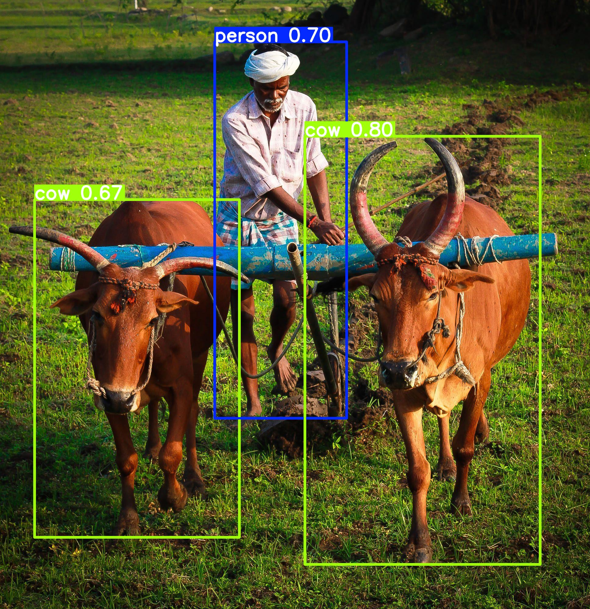

# 🚀 YOLO Object Detection  

Successfully detected **2 cows 🐄 and 1 person 🧑 in `farmer.jpg`** using YOLOv5. A great start to my Computer Vision journey!  

---

## 📌 Project Overview  
This project implements **YOLO (You Only Look Once)** for real-time object detection. It accurately identifies multiple objects in images, videos, and live webcam feeds.  

---

## 📸 Detection Results  

| **Before Detection**  | **After Detection**  |
|----------------------|----------------------|
|  |  |

---

## 🔥 Steps to Perform Object Detection  

### 1️⃣ **Install Dependencies**  
Ensure all required libraries are installed, including `torch`, `opencv-python`, and `matplotlib`.  

### 2️⃣ **Load the YOLO Model**  
Use the **YOLOv5s** pretrained model for object detection.  

### 3️⃣ **Load the Input Image**  
Read `farmers.jpg` using OpenCV.  

### 4️⃣ **Preprocess the Image**  
Convert it to RGB format for accurate detection.  

### 5️⃣ **Run YOLO Detection**  
Pass the image to the model and get predictions.  

### 6️⃣ **Save and Display Results**  
Generate `farmer-checkpoint.jpg` with bounding boxes and labels.  

### 7️⃣ **Real-Time Detection (Optional)**  
Use a webcam feed to detect objects in real time.  

---

## 🎯 Features  
✅ Fast and accurate object detection  
✅ Works with images, videos, and real-time webcam feed  
✅ Outputs bounding boxes, labels, and confidence scores  

---

## 🏗️ Future Enhancements  
- 🔥 Upgrade to **YOLOv8** for better accuracy  
- 🎥 Implement object tracking  
- 📈 Train a custom YOLO model  

---

## 📜 License  
This project is licensed under the **MIT License**.  

💡 *Inspired by Ultralytics' YOLOv5.*  

---

💬 **Got questions? Let's connect! 🚀**  
